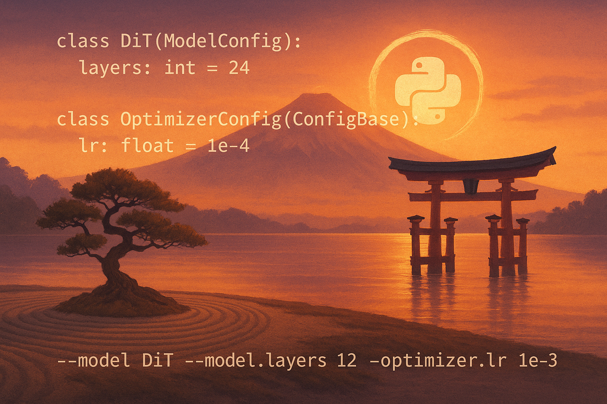

ZenCFG: A Zen way to configure your code
========================================
A Zen way to configure your Python packages while keeping your sanity.

Why ZenCFG?
-----------

ZenCFG (for *Zen ConFiGuration*), is the result of many iterations of trying pretty much every existing approach to Python configuration management systems and being satisfied by none of them. 

The key advantages of ZenCFG are:

**1. Native Python Tooling**
Work with configs like any other Python code—inheritance, composition, and type hints provide familiar development patterns.
This also means full IDE support with autocomplete, refactoring safety, and type checking.

**2. Reduced Debugging Time** 
Catch configuration errors at startup with type safety and runtime validation, not hours into expensive training runs.

**3. Quick and Flexible Experimentation**
Override any nested parameter through intuitive command-line syntax without file editing. 
Switch between model architectures, optimizers, and their specific parameters in a single command.

**4. Zero Boilerplate**
Pure Python classes with no frameworks, no special syntax, and no additional dependencies. If you know Python, you know ZenCFG.

Installation
------------

.. code-block:: bash

   pip install zencfg

Get Started
-----------

Ready to configure your Python code and handle your experiments the zen way? 
Get up and running in minutes with our :doc:`quickstart` guide.

For practical examples and common patterns, check out :doc:`examples`.

For all the technical details, see the :doc:`api` reference, and the :doc:`advanced` topics.

**Contributing:** Found a bug or want to contribute? Visit our `GitHub repository <https://github.com/jeankossaifi/zencfg>`_ 
to report issues or submit pull requests. See our :doc:`contribute` guide for development setup.

.. toctree::
   :maxdepth: 2
   :hidden:

   quickstart
   examples
   api
   advanced
   contribute

